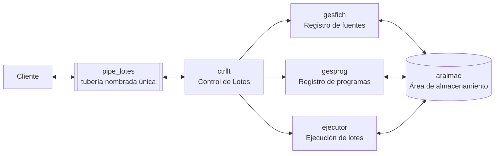
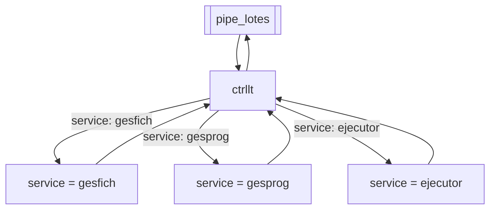
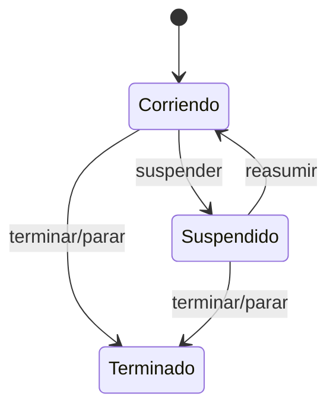
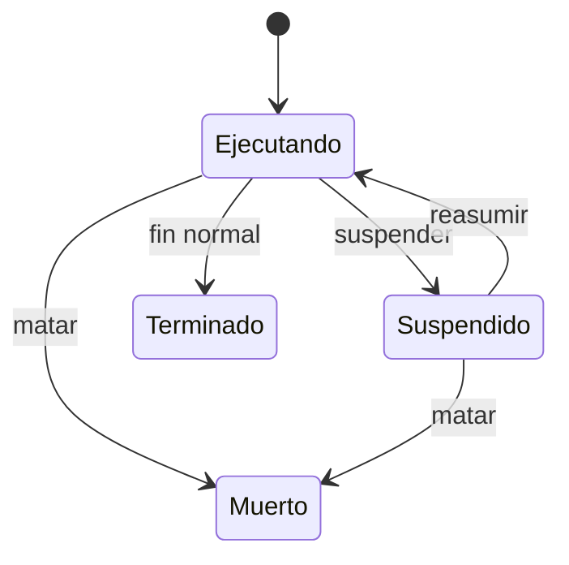
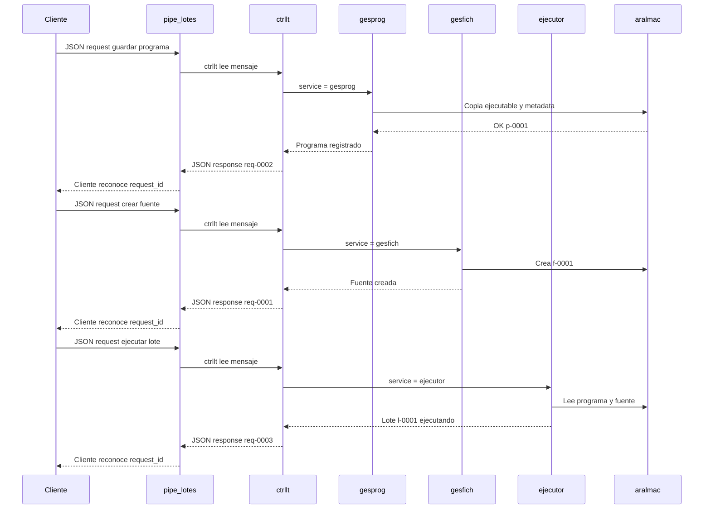

# Diseño de comunicación del sistema Ejecutor de Lotes

  

> Mi propuesta es manejar el sistema como una **taquilla única de procesos por lotes**. Todo entra por una sola tubería nombrada, el mensaje JSON dice qué se quiere hacer y `ctrllt` decide cómo moverlo por dentro. Así no queda una montonera de conexiones raras, sino una comunicación ordenada, defendible y fácil de implementar.

  

## 0. Resumen

  

La API propuesta usa **una sola tubería nombrada** como canal central de comunicación:

  

```text
pipe_lotes
```

  

Todos los mensajes viajan por esa tubería en formato **JSON**. La separación entre operaciones no se hace creando más tuberías, sino usando campos dentro del JSON, especialmente `service`, `operation`, `request_id` y `client_id`.

  

El cliente no tiene que ponerse a tocar tres puertas distintas ni adivinar quién resuelve qué. Llega a una sola ventanilla, entrega su pedido bien armado por `pipe_lotes` y `ctrllt` se encarga de moverlo por dentro.

  

```text
Cliente -> pipe_lotes -> ctrllt -> servicio lógico -> aralmac -> pipe_lotes -> Cliente
```


  

## 1. Idea central: una taquilla única

  

El sistema se diseñará como una arquitectura coordinada por `ctrllt`, que será el punto único de entrada. El cliente escribirá sus solicitudes en `pipe_lotes`; `ctrllt` leerá cada mensaje, mirará el campo `service` y decidirá si la operación corresponde a `gesfich`, `gesprog` o `ejecutor`.


La propuesta es que todos los mensajes usen JSON. Aunque por debajo se use una tubería nombrada, por encima la comunicación se siente como una API moderna, clara y fácil de probar.

  

## 1.1. Mi idea Creativa

La comunicación se puede explicar como un **sistema de sobres**:
- Cada petición es un sobre JSON.
- Todos los sobres entran por la misma tubería: `pipe_lotes`.
- El sobre trae remitente (`client_id`), número de guía (`request_id`), destino (`service`), acción (`operation`) y contenido (`payload`).
-  `ctrllt` es la taquilla que revisa el sobre y lo manda al área lógica correcta.
-  `gesfich`, `gesprog` y `ejecutor` son las áreas internas que resuelven.
-  `aralmac` es la bodega organizada donde queda guardado todo lo importante.
  
  

## 2. Componentes
| Componente | Responsabilidad | Ejemplos |
| :--- | :--- | :--- |
| `cliente` | Envía solicitudes y recibe respuestas por `pipe_lotes`. | Registrar programas, crear fuentes, ejecutar lotes. |
| `ctrllt` | Lee la tubería única, valida mensajes y enruta al servicio lógico correcto. | Pasarela central del sistema. |
| `gesfich` | Administra ficheros fuente usados como entrada/salida de procesos de lote. | Crear, leer, actualizar y borrar fuentes. |
| `gesprog` | Administra programas ejecutables y su configuración. | Guardar programa, consultar programa, actualizar argumentos. |
| `ejecutor` | Crea y controla procesos de lote. | Ejecutar, consultar estado, matar, suspender, reasumir. |
| `aralmac` | Zona persistente de almacenamiento. | Directorio local, base de datos o estructura mixta. |

  

La clave es que cada componente sabe hacer una sola cosa bien. `gesfich` no ejecuta, `ejecutor` no inventa programas, `gesprog` no administra fuentes. Cada uno hace lo suyo.

  

## 3. Comunicación por una sola tubería nombrada

La arquitectura tendrá una sola tubería nombrada pública:

```text
pipe_lotes
```
No se crean tuberías separadas para `gesfich`, `gesprog` ni `ejecutor`. La separación se hace dentro del mensaje JSON:



  

Para que una sola tubería pueda manejar todo sin volverse un enredo, cada mensaje incluye estos campos:
| Campo | Por qué es clave |
| :--- | :--- |
| `api_version` | Permite evolucionar la API sin romper clientes viejos. |
| `message_type` | Diferencia `request`, `response` y `event`. |
| `request_id` | Permite emparejar cada respuesta con su petición. |
| `client_id` | Permite saber qué cliente hizo la solicitud. |
| `service` | Indica el servicio lógico destino: `gesfich`, `gesprog` o `ejecutor`. |
| `operation` | Indica la acción concreta dentro del servicio. |
| `payload` | Lleva los datos propios de la operación. |
  
El flujo general será:
1. El cliente construye un mensaje JSON.
2. El cliente escribe el mensaje en `pipe_lotes`.
3.  `ctrllt` lee el mensaje y valida su estructura.
4.  `ctrllt` revisa el campo `service`.
5.  `ctrllt` enruta la petición al servicio lógico correspondiente.
6. El servicio ejecuta la operación sobre `aralmac` si aplica.
7. El servicio responde a `ctrllt`.
8.  `ctrllt` publica la respuesta en `pipe_lotes` con el mismo `request_id`.
9. El cliente reconoce su respuesta usando `request_id` y `client_id`.
  
En la implementación, cada JSON puede enviarse como una línea completa terminada en salto de línea. Eso permite leer mensaje por mensaje sin confundir dónde termina una solicitud y dónde empieza la siguiente.

  

## 4. Sobre `aralmac`

  

`aralmac` será el área común de almacenamiento. La idea es tratarlo como una **bodega organizada**, no como una carpeta donde se tira todo.

```text
aralmac/
fuentes/
f-0001/
contenido.dat
metadata.json
programas/
p-0001/
ejecutable
metadata.json
ejecuciones/
l-0001/
stdin.ref
stdout.log
stderr.log
metadata.json
```

Esta estructura permite demostrar orden y luego evolucionar a una base de datos si así se quisiera. La metadata guardará identificadores, fechas, estado, argumentos, variables de ambiente y rutas internas. La ventaja de separar el contenido y metadata es que podemos consultar rápido sin abrir archivos grandes. 

## 5. Petición general de mensajes

Toda petición tendrá esta forma base:

```json
{
"api_version": "1.0",
"message_type": "request",
"request_id": "req-20260502-0001",
"client_id": "cliente-01",
"service": "gesprog",
"operation": "guardar",
"payload": {}
}
```
Toda respuesta tendrá esta forma base:

```json
{
"api_version": "1.0",
"message_type": "response",
"request_id": "req-20260502-0001",
"client_id": "cliente-01",
"status": "ok",
"data": {},
"error": null
}
```
Si ocurre un error:
```json
{
"api_version": "1.0",
"message_type": "response",
"request_id": "req-20260502-0001",
"client_id": "cliente-01",
"status": "error",
"data": null,
"error": {
"code": "PROGRAMA_NO_EXISTE",
"message": "No existe un programa registrado con id p-9999"
}
}
```

## 6. API de `gesfich`: registro de fuentes

  
`gesfich` administra los ficheros que serán fuente o destino de los procesos de lote.
| Operación | Descripción | Entrada principal | Respuesta |
| :--- | :--- | :--- | :--- |
| `crear` | Crea un fichero vacío en `aralmac`. | Opcional: nombre lógico. | `file_id`, ejemplo `f-0001`. |
| `leer` | Lee un fichero específico o lista todos si no se envía id. | `file_id` opcional. | Contenido o listado de ficheros. |
| `actualizar` | Copia el contenido de una ruta local hacia el fichero registrado. | `file_id`, `source_path`. | Metadata actualizada. |
| `borrar` | Elimina un fichero registrado. | `file_id`. | Confirmación. |
| `suspender` | Suspende el servicio si el estado lo permite. | Sin payload. | Estado del servicio. |
| `reasumir` | Reactiva el servicio si estaba suspendido. | Sin payload. | Estado del servicio. |
| `terminar` | Termina el servicio de forma controlada. | Sin payload. | Confirmación. |

Ejemplo de creación de fuente:

```json
{
"api_version": "1.0",
"message_type": "request",
"request_id": "req-0001",
"client_id": "cliente-01",
"service": "gesfich",
"operation": "crear",
"payload": {
"logical_name": "entrada-clientes"
}
}
```
## 7. API de `gesprog`: registro de programas

`gesprog` administra los programas que podrán ser ejecutados posteriormente por `ejecutor`.
| Operación | Descripción | Entrada principal | Respuesta |
| :--- | :--- | :--- | :--- |
| `guardar` | Registra un ejecutable, argumentos y ambiente. | `executable_path`, `args`, `env`. | `program_id`, ejemplo `p-0001`. |
| `leer` | Consulta un programa o lista todos. | `program_id` opcional. | Metadata del programa. |
| `actualizar` | Actualiza ejecutable, argumentos o variables de ambiente. | `program_id`, campos nuevos. | Metadata actualizada. |
| `borrar` | Elimina un programa registrado. | `program_id`. | Confirmación. |
| `suspender` | Suspende el servicio. | Sin payload. | Estado del servicio. |
| `reasumir` | Reactiva el servicio. | Sin payload. | Estado del servicio. |
| `terminar` | Termina el servicio. | Sin payload. | Confirmación. |

Ejemplo de registro de programa:

```json
{
"api_version": "1.0",
"message_type": "request",
"request_id": "req-0002",
"client_id": "cliente-01",
"service": "gesprog",
"operation": "guardar",
"payload": {
"name": "contador-lineas",
"executable_path": "./bin/contador",
"args": ["--modo", "resumen"],
"env": {
"LC_ALL": "C.UTF-8"
}
}
}
```
## 8. API de `ejecutor`: procesos de lote

`ejecutor` toma programas y fuentes ya registrados en `aralmac`, crea procesos de lote y administra su ciclo de vida.

| Operación | Descripción | Entrada principal | Respuesta |
| :--- | :--- | :--- | :--- |
| `ejecutar` | Lanza uno o varios pasos de lote. | Arreglo de pasos. | `job_id`, ejemplo `l-0001`. |
| `estado` | Consulta un lote específico o lista todos. | `job_id` opcional. | Estado actual. |
| `matar` | Finaliza forzosamente un lote. | `job_id`. | Estado final. |
| `suspender` | Suspende un lote. | `job_id`. | Estado actualizado. |
| `reasumir` | Reactiva un lote suspendido. | `job_id`. | Estado actualizado. |
| `parar` | Detiene el servicio ejecutor de forma controlada. | Sin payload. | Confirmación. |

Ejemplo de ejecución:

```json
{
"api_version": "1.0",
"message_type": "request",
"request_id": "req-0003",
"client_id": "cliente-01",
"service": "ejecutor",
"operation": "ejecutar",
"payload": {
"job_name": "resumen-clientes",
"steps": [
{
"program_id": "p-0001",
"stdin_file_id": "f-0001",
"stdout_file_id": "f-0002",
"args_override": ["--formato", "tabla"]
}
]
}
}
```

## 9. Estados propuestos

Los servicios tendrán estados simples:


  

Los procesos de lote tendrán estados propios:

  


## 10. Códigos de error
| Código | Cuándo ocurre |
| :--- | :--- |
| `JSON_INVALIDO` | El mensaje no es JSON válido. |
| `TIPO_MENSAJE_INVALIDO` | `message_type` no es `request`, `response` o `event`. |
| `SERVICIO_DESCONOCIDO` | `service` no corresponde a `gesfich`, `gesprog` o `ejecutor`. |
| `OPERACION_DESCONOCIDA` | La operación no existe para el servicio solicitado. |
| `PAYLOAD_INVALIDO` | Faltan campos obligatorios o tienen tipo incorrecto. |
| `FUENTE_NO_EXISTE` | No existe el `file_id` solicitado. |
| `PROGRAMA_NO_EXISTE` | No existe el `program_id` solicitado. |
| `LOTE_NO_EXISTE` | No existe el `job_id` solicitado. |
| `SERVICIO_SUSPENDIDO` | El servicio no puede atender operaciones en ese momento. |
| `ERROR_ALMACENAMIENTO` | Falla leyendo o escribiendo en `aralmac`. |
| `ERROR_EJECUCION` | El proceso de lote no pudo lanzarse o terminó con error. |

## 11. Ejemplo completo de conversación



  

## 12. Decisiones que hacen la propuesta apropiada

1.  **Una sola tubería nombrada:** simplifica la comunicación y cumple la idea central del profesor.

2.  **Un solo contrato JSON para todo el sistema:** reduce ambigüedad y facilita pruebas.

3.  **`ctrllt` como pasarela:** el cliente no necesita conocer detalles internos de cada servicio.

4.  **`request_id` obligatorio:** permite manejar muchas solicitudes usando el mismo canal.

5.  **`message_type` obligatorio:** evita confundir peticiones, respuestas y eventos.

6.  **Identificadores humanos y ordenados:**  `f-0001`, `p-0001`, `l-0001`.

7.  **Metadata separada del contenido:** permite consultar sin leer archivos completos.

8.  **Errores normalizados:** cada falla se puede explicar y manejar igual desde el cliente.