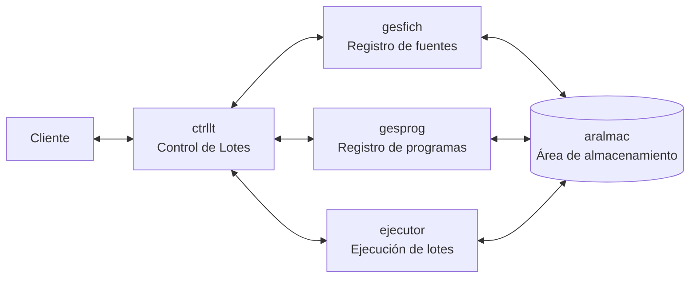
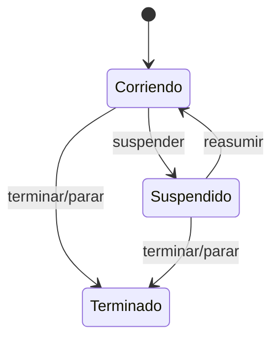
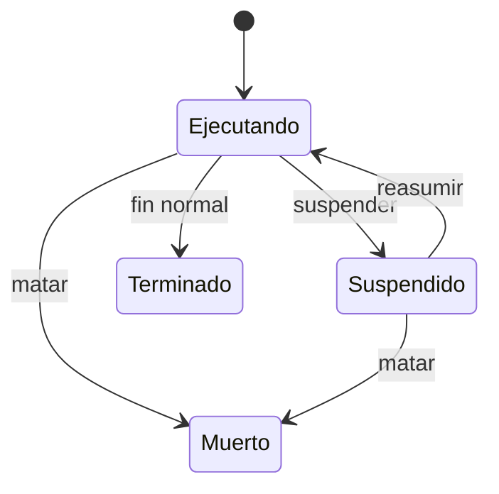
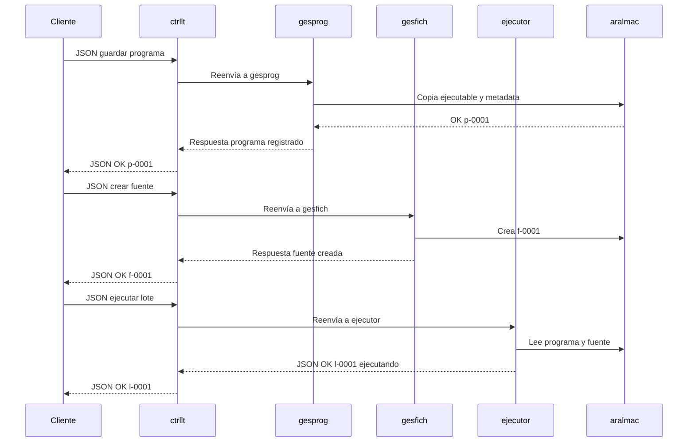

# Diseño de comunicación del sistema Ejecutor de Lotes

  

> Propuesta: que el sistema se entienda como una **taquilla única de procesos por lotes**. El cliente llega con una solicitud en JSON, `ctrllt` la recibe, mira para dónde va, se la entrega al servicio correcto y devuelve una respuesta clara. Así no queda una montonera de conexiones raras, sino una comunicación ordenada, defendible y fácil de implementar.

  

## 0. Resumen

  

La API propuesta convierte el sistema en una red de servicios pequeños, cada uno con una responsabilidad clara, conectados por tuberías nombradas y hablando un único idioma: **JSON**.

  

La idea más fuerte del diseño es que `ctrllt` sea el único punto de entrada para el cliente. El cliente no tiene que ponerse a tocar tres puertas distintas ni adivinar quién resuelve qué. Llega a una sola ventanilla, entrega su pedido bien armado y `ctrllt` se encarga de moverlo por dentro.
```text

Cliente -> JSON -> ctrllt -> servicio correcto -> aralmac -> respuesta JSON -> Cliente

```
La gracia de esta propuesta es que deja el sistema listo para crecer. Si mañana cambia el almacenamiento, se agregan más clientes o se quiere registrar más información, no toca romper la comunicación principal.

  

## 1. Idea central: una taquilla única

El sistema se diseñará como una arquitectura de servicios comunicados por **tuberías nombradas**. El cliente no hablará directamente con todos los módulos internos en el flujo normal: enviará sus solicitudes a `ctrllt`, que actuará como **pasarela inteligente** y redirigirá cada operación al servicio responsable.

La propuesta es que todos los mensajes usen **JSON**. Esto hace que la API sea fácil de probar, leer, validar y presentar. Aunque por debajo estemos usando tuberías nombradas, por encima la comunicación se siente como una API moderna, ordenada y legible.

  

## 1.1. Mi idea creativa
La comunicación se puede explicar como un **sistema de sobres**:
- Cada petición es un sobre JSON.
- El sobre siempre trae remitente (`client_id`), número de guía (`request_id`), destino (`service`), acción (`operation`) y contenido (`payload`).
-  `ctrllt` es la taquilla que revisa el sobre y lo manda al área correcta.
-  `gesfich`, `gesprog` y `ejecutor` son las áreas internas que resuelven.
-  `aralmac` es el archivo central donde queda guardado todo lo importante.

## 2. Componentes


| Componente | Responsabilidad | Ejemplos |
| :--- | :--- | :--- |
| `cliente` | Envía solicitudes y muestra respuestas. | Registrar programas, crear fuentes, ejecutar lotes. |
| `ctrllt` | Recibe solicitudes, valida el destino y enruta al servicio correcto. | Pasarela entre cliente y servicios. |
| `gesfich` | Administra ficheros fuente usados como entrada/salida de procesos de lote. | Crear, leer, actualizar y borrar fuentes. |
| `gesprog` | Administra programas ejecutables y su configuración. | Guardar programa, consultar programa, actualizar argumentos. |
| `ejecutor` | Crea y controla procesos de lote. | Ejecutar, consultar estado, matar, suspender, reasumir. |
| `aralmac` | Zona persistente de almacenamiento. | Directorio local, base de datos o estructura mixta. |
  

La clave es que cada componente sabe hacer una sola cosa bien. `gesfich` no ejecuta, `ejecutor` no inventa programas, `gesprog` no administra fuentes. Cada uno hace lo suyo.

  

## 3. Comunicación por tuberías nombradas

Cada servicio tendrá una tubería principal para recibir peticiones. Si el sistema operativo soporta tuberías nombradas `full-duplex`, una sola tubería podrá servir para petición y respuesta. Si solo se trabaja con `half-duplex`, se usará una tubería adicional para respuestas.

| Servicio | Tubería de petición | Tubería de respuesta opcional |
| :--- | :--- | :--- |
| `ctrllt` | `-c <pipe_ctrllt_req>` | `-a <pipe_ctrllt_res>` |
| `gesfich` | `-f <pipe_gesfich_req>` | `-b <pipe_gesfich_res>` |
| `gesprog` | `-p <pipe_gesprog_req>` | `-c <pipe_gesprog_res>` |
| `ejecutor` | `-e <pipe_ejecutor_req>` | `-d <pipe_ejecutor_res>` |

El flujo general será:
1. El cliente construye un mensaje JSON.
2. El cliente escribe el mensaje en la tubería de `ctrllt`.
3.  `ctrllt` valida el campo `service`.
4.  `ctrllt` reenvía la petición al servicio correspondiente.
5. El servicio ejecuta la operación sobre `aralmac` si aplica.
6. El servicio responde a `ctrllt`.
7.  `ctrllt` devuelve la respuesta al cliente.

Así se evita el enredo típico de proyectos donde cada módulo habla distinto. Acá todos hablan JSON, todos responden con el mismo formato y `ctrllt` mantiene el orden.

## 4. Sobre `aralmac`

`aralmac` será el área común de almacenamiento. La idea es tratarlo como una **bodega organizada**, no como una carpeta donde se tira todo. Para la implementación inicial se propone usar un directorio local con estructura clara:

  

```text
aralmac/
fuentes/
f-0001/
contenido.dat
metadata.json
programas/
p-0001/
ejecutable
metadata.json
ejecuciones/
l-0001/
stdin.ref
stdout.log
stderr.log
metadata.json
```
Esta estructura permite demostrar orden  y luego evolucionar a una base de datos si así se quisiera. El archivo "metadata" guardará los identificadores, fechas, estado, argumentos, variables de ambiente y rutas internas.

La ventaja de separar contenido y metadata es que podemos consultar rápido sin abrir archivos grandes.
## 5. Petición general de mensajes
Toda petición tendrá la misma forma base:
```json
{
"api_version": "1.0",
"request_id": "req-20260502-0001",
"client_id": "cliente-01",
"service": "gesprog",
"operation": "guardar",
"payload": {}
}
```
Campos de la petición:

Distribución: | Campo | Para qué sirve |

| `api_version` | Permite evolucionar la API sin romper clientes viejos. |
| `request_id` | Sirve para rastrear una petición de punta a punta. |
| `client_id` | Identifica quién está haciendo la solicitud. |
| `service` | Dice si la solicitud va para `gesfich`, `gesprog` o `ejecutor`. |
| `operation` | Dice qué acción se quiere hacer. |
| `payload` | Contiene los datos propios de la operación. |

Toda respuesta tendrá la misma forma base:
```json
{
"api_version": "1.0",
"request_id": "req-20260502-0001",
"status": "ok",
"data": {},
"error": null
}
```
Si ocurre un error:
```json
{
"api_version": "1.0",
"request_id": "req-20260502-0001",
"status": "error",
"data": null,
"error": {
"code": "PROGRAMA_NO_EXISTE",
"message": "No existe un programa registrado con id p-9999"
}
}
```

## 6. API de `gesfich`: registro de fuentes
`gesfich` administra los ficheros que serán fuente o destino de los procesos de lote.

| Operación | Descripción | Entrada principal | Respuesta |
| :--- | :--- | :--- | :--- |
| `crear` | Crea un fichero vacío en `aralmac`. | Opcional: nombre lógico. | `file_id`, ejemplo `f-0001`. |
| `leer` | Lee un fichero específico o lista todos si no se envía id. | `file_id` opcional. | Contenido o listado de ficheros. |
| `actualizar` | Copia el contenido de una ruta local hacia el fichero registrado. | `file_id`, `source_path`. | Metadata actualizada. |
| `borrar` | Elimina un fichero registrado. | `file_id`. | Confirmación. |
| `suspender` | Suspende el servicio si el estado lo permite. | Sin payload. | Estado del servicio. |
| `reasumir` | Reactiva el servicio si estaba suspendido. | Sin payload. | Estado del servicio. |
| `terminar` | Termina el servicio de forma controlada. | Sin payload. | Confirmación. |
Ejemplo de creación de fuente:
```json
{
"api_version": "1.0",
"request_id": "req-0001",
"client_id": "cliente-01",
"service": "gesfich",
"operation": "crear",
"payload": {
"logical_name": "entrada-clientes"
}
}
```
Respuesta:
```json
{
"api_version": "1.0",
"request_id": "req-0001",
"status": "ok",
"data": {
"file_id": "f-0001",
"state": "creado",
"storage_path": "aralmac/fuentes/f-0001/contenido.dat"
},
"error": null
}
```
## 7. API de `gesprog`: registro de programas
`gesprog` administra los programas que podrán ser ejecutados posteriormente por `ejecutor`.

| Operación | Descripción | Entrada principal | Respuesta |
| :--- | :--- | :--- | :--- |
| `guardar` | Registra un ejecutable, argumentos y ambiente. | `executable_path`, `args`, `env`. | `program_id`, ejemplo `p-0001`. |
| `leer` | Consulta un programa o lista todos. | `program_id` opcional. | Metadata del programa. |
| `actualizar` | Actualiza ejecutable, argumentos o variables de ambiente. | `program_id`, campos nuevos. | Metadata actualizada. |
| `borrar` | Elimina un programa registrado. | `program_id`. | Confirmación. |
| `suspender` | Suspende el servicio. | Sin payload. | Estado del servicio. |
| `reasumir` | Reactiva el servicio. | Sin payload. | Estado del servicio. |
| `terminar` | Termina el servicio. | Sin payload. | Confirmación. |

Ejemplo de registro de programa:
```json
{
"api_version": "1.0",
"request_id": "req-0002",
"client_id": "cliente-01",
"service": "gesprog",
"operation": "guardar",
"payload": {
"name": "contador-lineas",
"executable_path": "./bin/contador",
"args": ["--modo", "resumen"],
"env": {
"LC_ALL": "C.UTF-8"
}
}
}
```
Respuesta:
```json
{
"api_version": "1.0",
"request_id": "req-0002",
"status": "ok",
"data": {
"program_id": "p-0001",
"name": "contador-lineas",
"state": "registrado",
"storage_path": "aralmac/programas/p-0001/"
},
"error": null
}
```
## 8. API de `ejecutor`: procesos de lote
`ejecutor` toma programas y fuentes ya registrados en `aralmac`, crea procesos de lote y administra su ciclo de vida.
| Operación | Descripción | Entrada principal | Respuesta |
| :--- | :--- | :--- | :--- |
| `ejecutar` | Lanza uno o varios pasos de lote. | Arreglo de pasos. | `job_id`, ejemplo `l-0001`. |
| `estado` | Consulta un lote específico o lista todos. | `job_id` opcional. | Estado actual. |
| `matar` | Finaliza forzosamente un lote. | `job_id`. | Estado final. |
| `suspender` | Suspende un lote. | `job_id`. | Estado actualizado. |
| `reasumir` | Reactiva un lote suspendido. | `job_id`. | Estado actualizado. |
| `parar` | Detiene el servicio ejecutor de forma controlada. | Sin payload. | Confirmación. |

Ejemplo de ejecución:
```json
{
"api_version": "1.0",
"request_id": "req-0003",
"client_id": "cliente-01",
"service": "ejecutor",
"operation": "ejecutar",
"payload": {
"job_name": "resumen-clientes",
"steps": [
{
"program_id": "p-0001",
"stdin_file_id": "f-0001",
"stdout_file_id": "f-0002",
"args_override": ["--formato", "tabla"]
}
]
}
}
```
Respuesta:
```json
{
"api_version": "1.0",
"request_id": "req-0003",
"status": "ok",
"data": {
"job_id": "l-0001",
"state": "ejecutando",
"created_at": "2026-05-02T17:30:00-05:00"
},
"error": null
}
```
## 9. Estados propuestos
Los servicios tendrán estados simples:

Los procesos de lote tendrán estados propios:



## 10. Códigos de error
| Código | Cuándo ocurre |
| :--- | :--- |
| `JSON_INVALIDO` | El mensaje no es JSON válido. |
| `SERVICIO_DESCONOCIDO` | `service` no corresponde a `gesfich`, `gesprog` o `ejecutor`. |
| `OPERACION_DESCONOCIDA` | La operación no existe para el servicio solicitado. |
| `PAYLOAD_INVALIDO` | Faltan campos obligatorios o tienen tipo incorrecto. |
| `FUENTE_NO_EXISTE` | No existe el `file_id` solicitado. |
| `PROGRAMA_NO_EXISTE` | No existe el `program_id` solicitado. |
| `LOTE_NO_EXISTE` | No existe el `job_id` solicitado. |
| `SERVICIO_SUSPENDIDO` | El servicio no puede atender operaciones CRUD en ese momento. |
| `ERROR_ALMACENAMIENTO` | Falla leyendo o escribiendo en `aralmac`. |
| `ERROR_EJECUCION` | El proceso de lote no pudo lanzarse o terminó con error. |

## 11. Ejemplo completo de conversación

## 12. Decisiones que hacen la propuesta robusta

1.  **Un solo contrato JSON para todo el sistema:** reduce ambigüedad y facilita pruebas.
2.  **`ctrllt` como pasarela:** el cliente no necesita conocer detalles internos de cada servicio.
3.  **Identificadores humanos y ordenados:**  `f-0001`, `p-0001`, `l-0001`.
4.  **Metadata separada del contenido:** permite consultar sin leer archivos completos.
5.  **Soporte para `full-duplex` y `half-duplex`:** el diseño se adapta a Windows y Linux.
6.  **Errores normalizados:** cada falla se puede explicar y manejar igual desde el cliente.